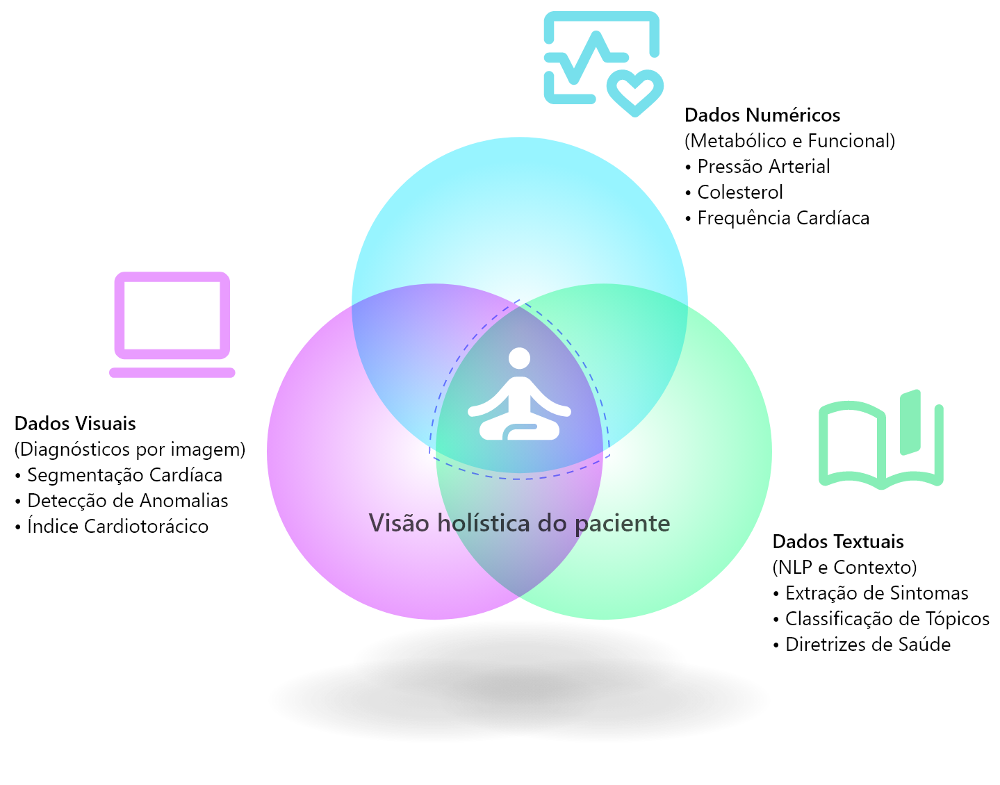

## FIAP - Faculdade de Informática e Administração Paulista

    

 

# A Busca de Dados Preparando o Terreno para a Inteligência Cardiológica

## Grupo TiãoTech

    

### Integrantes
- <a href="https://www.linkedin.com/in/edmilson-marciano-02648a33">RM565912 - Edmilson Marciano</a>
- <a href="https://www.linkedin.com/in/jayromazzi">RM565576 - Jayro Mazzi Junior</a>
- <a href="https://www.linkedin.com/in/lucas-a-5b7a70110">RM563353 - Lucas Arcanjo</a>
- <a href="https://www.linkedin.com/in/vinicius-andrade-01208822b">RM564544 - Marcus Vinicius de Andrades Silva Malaquias</a>

### Professores
### Tutor
- <a href="https://www.linkedin.com/in/caique-nonato/">Caique Nonato da Silva Bezerra</a>

### Coordenador(a)
- <a href="https://www.linkedin.com/in/andregodoichiovato">Andre Godoi Chiovato</a>

## Visão geral
Este repositório documenta a etapa de curadoria e investigação de dados para um projeto de Inteligência Artificial aplicado à Cardiologia. O foco desta fase é buscar, identificar e coletar conjuntos de dados cardiológicos, compreender a sua procedência, avaliar a sua integridade, relevância clínica e como diferentes modalidades (numérica, textual e visual) podem ser exploradas por algoritmos de IA.

<figure>
  
  <figcaption><i>Figura 1: Diagrama de Tríade de Conhecimento Cardíaco. Esta sobreposição de Venn ilustra como os dados Numéricos, Textuais e Visuais se complementam para criar um entendimento holístico da saúde do paciente, justificando o uso de múltiplas modalidades na fase de busca de dados.</i></figcaption>
</figure>

> 
> *Figura 1: Diagrama de Tríade de Conhecimento Cardíaco. Esta sobreposição de Venn ilustra como os dados Numéricos, Textuais e Visuais se complementam para criar um entendimento holístico da saúde do paciente, justificando o uso de múltiplas modalidades na fase de busca de dados.*

## 1. Dados numéricos O contexto metabólico e funcional
Para esta categoria, foram selecionados datasets que representam os sinais vitais e os biomarcadores fundamentais para a saúde cardiovascular.

### Origem e Objetivos dos Datasets
Nesta seção, exploramos a procedência e o impacto dos dados que fundamentam as análises quantitativas.

#### Cardiovascular Disease Dataset
> - **Histórico e Contexto** Este dataset é um clássico da área de saúde, frequentemente utilizado para benchmarking de algoritmos de classificação. Ele foca em exames de rotina para identificar a presença de doenças cardiovasculares em uma fase assintomática.
>
> - **Origem** Dados coletados na Rússia (Mendeley Data / Svetlana Ulianova), com registros consolidados por volta de 2019.
>
> - **Estatísticas (Kaggle)** Possui nota de Usabilidade 10.0, mais de 10.000 upvotes e centenas de milhares de downloads, sendo citado em diversos artigos acadêmicos sobre Random Forest e XGBoost.
>
> - **Licença** Attribution 4.0 International (CC BY 4.0).

| Artefatos | |
| --- | --- |
| Link dataset original | [www.kaggle.com/datasets/sulianova/cardiovascular-disease-dataset](https://www.kaggle.com/datasets/sulianova/cardiovascular-disease-dataset) |
| Link local | [dataset/cardiovascular_disease](dataset/cardiovascular_disease) |
| Link Google Drive | [drive.google.com/drive/folders/11T3nwl_bOY6uIM-yBvVKdBCK5ulLAjGE?usp=sharing](https://drive.google.com/drive/folders/11T3nwl_bOY6uIM-yBvVKdBCK5ulLAjGE?usp=sharing) |

#### Heart Failure Prediction Dataset
> - **Histórico e Contexto** Trata-se de um dataset "sintético" resultante da combinação de 5 bases de dados hospitalares independentes (Cleveland, Hungria, Suíça, Long Beach e Stalog). É o dataset mais abrangente disponível publicamente para prever falhas cardíacas com base em sintomas clínicos.
>
> - **Origem** Consolidado em 2021 (Multinacional: EUA, Hungria e Suíça).
>
> - **Estatísticas (Kaggle)** Usabilidade 10.0, cerca de 6.000 upvotes. É reconhecido por não possuir valores nulos, facilitando o treinamento de modelos robustos.
>
> - **Licença** Open Data Commons Attribution License (ODC-By) v1.0.

| Artefatos | |
| --- | --- |
| Link dataset original | [https://www.kaggle.com/datasets/fedesoriano/heart-failure-prediction/data](https://www.kaggle.com/datasets/fedesoriano/heart-failure-prediction/data) |
| Link local |  [dataset/heart_failure](dataset/heart_failure)
| Link Google Drive | [drive.google.com/drive/folders/1alQ0DYefEby8D6VibpsmCXtH70PNYnh_?usp=sharing](https://drive.google.com/drive/folders/1alQ0DYefEby8D6VibpsmCXtH70PNYnh_?usp=sharing) |

#### Variáveis relevantes e justificativa clínica
> - **Pressão Arterial Sistólica/Diastólica** Essencial para identificar a hipertensão, o principal preditor de danos vasculares e eventos agudos. 
>
> - **Colesterol** Variável crítica para avaliar o risco de aterosclerose e obstrução arterial a longo prazo.
>
> - **Frequência Cardíaca Máxima (MaxHR)** Indica a eficiência do bombeamento cardíaco sob estresse, sendo um marcador vital para a reserva funcional do coração.
>
> - **Depressão de ST (Oldpeak)** Variável derivada do eletrocardiograma (ECG) que indica isquemia miocárdica (falta de oxigenação no músculo cardíaco).
> 

**Relevância para IA** - Para um projeto de saúde, essas variáveis funcionam como "features" de alta correlação, permitindo que modelos de aprendizado de máquina aprendam a distinguir entre padrões de normalidade e estados patológicos com base em evidências fisiológicas concretas.

## 2. Dados Textuais Processamento de Linguagem Natural (NLP)
A análise de dados não estruturados permite que a IA compreenda a literatura médica, as normas de conduta e o contexto epidemiológico do sistema de saúde brasileiro.

### Fontes Selecionadas

#### Diretrizes Brasileiras de Insuficiência Cardíaca Crônica e Aguda (SBC)
> - **Por que este texto?** É o documento oficial da Sociedade Brasileira de Cardiologia que padroniza o diagnóstico e tratamento no país. Selecionamos este texto por ser a "fonte da verdade" (Ground Truth) para qualquer sistema de IA que pretenda operar legal e clinicamente no Brasil.
>
> - **Relevância** É a referência máxima para médicos e hospitais do SUS e da rede privada. Ele define os critérios de classificação de risco que a IA deve emular.
>
> - **Dados Estatísticos** Publicada nos Arquivos Brasileiros de Cardiologia (fator de impacto relevante na América Latina), esta diretriz possui milhares de citações e é o documento mais consultado por cardiologistas brasileiros para a tomada de decisão clínica.

| Artefatos | |
| --- | --- |
| Título original | **Diretriz Brasileira de Insuficiência Cardíaca Crônica e Aguda** |
| Link original | [www.scielo.br/j/abc/a/XkVKFb4838qXrXSYbmCYM3K/?lang=pt](https://www.scielo.br/j/abc/a/XkVKFb4838qXrXSYbmCYM3K/?lang=pt) |
| Link PDF externo | [www.scielo.br/j/abc/a/XkVKFb4838qXrXSYbmCYM3K/?format=pdf&lang=pt](https://www.scielo.br/j/abc/a/XkVKFb4838qXrXSYbmCYM3K/?format=pdf&lang=pt) |
| Link PDF local | [documents/diretriz_brasileira_de_insuficiencia_cardiaca_cronica_e_aguda.pdf](documents/diretriz_brasileira_de_insuficiencia_cardiaca_cronica_e_aguda.pdf) |
| Link PDF Google Drive | [drive.google.com/file/d/1BLCramS381LNTNc4icAeZLggScii_C5_/view?usp=sharing](https://drive.google.com/file/d/1BLCramS381LNTNc4icAeZLggScii_C5_/view?usp=sharing) |

#### Atualização de Tópicos Emergentes da Diretriz de Insuficiência Cardíaca (SBC)
> - **Por que este texto?** Selecionamos este documento pois ele complementa a diretriz principal com as evidências mais recentes (2021) sobre o manejo da doença no Brasil. Ele foca em novas terapias e perfis epidemiológicos recentes.
>
> - **Relevância** É o documento que orienta a conduta médica atualizada nas unidades de saúde brasileiras. Ele contém a terminologia técnica mais moderna usada em prontuários e relatórios médicos.
>
> - **Dados Estatísticos** Publicado pela Sociedade Brasileira de Cardiologia, este documento é a referência normativa para mais de 14.000 cardiologistas no país, sendo o pilar central para a atualização de protocolos de saúde.

| Artefatos |  |
| --- | --- |
| Título original | **Atualização de Tópicos Emergentes da Diretriz de Insuficiência Cardíaca** |
| Link original | [abccardiol.org/article/atualizacao-de-topicos-emergentes-da-diretriz-brasileira-de-insuficiencia-cardiaca-2021/](https://abccardiol.org/article/atualizacao-de-topicos-emergentes-da-diretriz-brasileira-de-insuficiencia-cardiaca-2021/) |
| Link PDF externo | [abccardiol.org/wp-content/uploads/articles_xml/0066-782X-abc-116-06-1174/0066-782X-abc-116-06-1174.x74770.pdf](https://abccardiol.org/wp-content/uploads/articles_xml/0066-782X-abc-116-06-1174/0066-782X-abc-116-06-1174.x74770.pdf) |
| Link PDF local | [documents/atualizacao_de_topicos_emergentes-da_diretriz_brasileira_de_insuficiencia_cardiaca_2021.pdf](documents/atualizacao_de_topicos_emergentes-da_diretriz_brasileira_de_insuficiencia_cardiaca_2021.pdf) |
| Link PDF Google Drive | [drive.google.com/file/d/11TFQa9vaMpnUQkma29x2r5nBoLf5OWe-/view?usp=sharing](https://drive.google.com/file/d/11TFQa9vaMpnUQkma29x2r5nBoLf5OWe-/view?usp=sharing) |

#### Exploração dos textos via algoritmos de NLP
A aplicação de técnicas de Processamento de Linguagem Natural sobre estas fontes permite a conversão de conhecimento científico passivo em modelos de dados acionáveis. Através do uso de modelos de linguagem (LLMs) e bibliotecas especializadas, é possível extrair a semântica clínica e as regras de negócio da medicina cardiológica, garantindo que o sistema de IA opere de acordo com os protocolos vigentes e a realidade epidemiológica brasileira.

> - **Extração de Entidades Nomeadas (NER)** Algoritmos podem ser treinados para identificar automaticamente sintomas mencionados (ex: dispneia, ortopneia) e medicamentos citados, criando um dicionário de termos extraídos diretamente da literatura nacional.
>
> - **Classificação de Tópicos (Topic Modeling)** Permite organizar automaticamente grandes volumes de literatura, separando discussões sobre "Sintomas" de "Protocolos de Intervenção".
>
> - **Sumarização Automática** Essencial para extrair pontos-chave de diretrizes extensas, entregando ao profissional apenas a conduta relevante para o perfil do paciente em análise.
>
**Justificativa** - A análise textual humaniza o projeto de IA, garantindo que o sistema não apenas processe números, mas compreenda o conhecimento acumulado em décadas de literatura médica brasileira, auxiliando na medicina baseada em evidências.

## 3. Dados Visuais Diagnóstico por Visão Computacional
Os dados visuais permitem que a IA identifique alterações físicas e estruturais que podem não ser captadas em exames laboratoriais puros.

### Origem e Objetivos do Dataset

#### NIH ChestX-ray14
> - **Histórico e Contexto** 
O NIH ChestX-ray14 é um conjunto de dados proveniente do National Institutes of Health (EUA), cujo objetivo é fornecer uma base massiva de radiografias de tórax rotuladas para o treinamento de diagnósticos assistidos por computador. Constitui um marco na Visão Computacional Médica, tendo substituído o antigo ChestX-ray8, expandindo a capacidade de detecção de 8 para 14 patologias diferentes através de mineração de texto em relatórios radiológicos.
>
> - **Origem** 
Estados Unidos (NIH Clinical Center), publicado originalmente em 2017.
>
> - **Estatísticas** 
É um dos datasets mais citados no Google Scholar na área de radiologia computacional. No Kaggle, a amostra reduzida possui Usabilidade 8.2 e milhares de menções em competições de detecção de pneumonia e cardiomegalia.
>
> - **Licença** 
Domínio Público (CC0: Public Domain), permitindo uso irrestrito para pesquisa.

| Artefatos | |
| --- | --- |
| Link dataset original | [www.kaggle.com/datasets/nih-chest-xrays/data](https://www.kaggle.com/datasets/nih-chest-xrays/data) |
| Link local | [dataset/nih_chest_x-ray/NIH_Xray_300](dataset/nih_chest_x-ray/NIH_Xray_300) |
| Link Google Drive | [drive.google.com/drive/folders/1mY7Sdj7hZmnB7NJGLHKUG66va-Yap-E1?usp=sharing](https://drive.google.com/drive/folders/1mY7Sdj7hZmnB7NJGLHKUG66va-Yap-E1?usp=sharing) |

#### Exploração via Visão Computacional
> - **Detecção de Padrões e Anomalias** Algoritmos podem ser treinados para identificar "infiltrados" ou "edemas" nos pulmões, sinais indiretos de falha cardíaca.
>
> - **Identificação de Bordas (Segmentação)** Utilizada para isolar a silhueta do coração e calcular o Índice Cardiotorácico. Se o coração ocupa mais de 50% da largura do tórax, o sistema sinaliza Cardiomegalia.
>
> - **Reconhecimento de Dispositivos Implantados** Identificação automática de marca-passos ou stents, fornecendo contexto vital sobre o histórico cirúrgico do paciente.
>
> - **Importância para IA** A visão computacional atua como um multiplicador de eficiência, permitindo a triagem ultrarrápida de exames em unidades de emergência e reduzindo a variabilidade interpretativa entre diferentes examinadores.

## 4. Estratégia de Curadoria
Para este projeto, aplicamos uma técnica de Downsampling Estratificado, reduzindo cada dataset para um volume controlado de 300 registros. Esta decisão baseia-se em três pilares:
>
> - **Balanceamento de Classes** Ao selecionar 150 casos positivos e 150 negativos, evitamos o "vício" (bias) do modelo, garantindo que a IA aprenda igualmente a detectar a saúde e a doença.
>
> - **Viabilidade Computacional** O número 300 permite que o processamento (especialmente das imagens de 5GB) seja realizado em ambientes de estudo (como o Google Colab) sem estourar o limite de memória RAM e disco.
>
> - **Significância Estatística (Teorema do Limite Central)** Em estatística, amostras acima de 30 ou 100 já costumam apresentar uma distribuição normal e tendências claras. Com 300 amostras, temos volume suficiente para demonstrar a eficácia da IA sem a redundância de milhares de dados idênticos.

## 5. Citações e Créditos Originais
Para fins acadêmicos e éticos, abaixo estão as referências diretas às fontes dos dados:

| Dataset / Documento | Citação Original / Autor  | Fonte / Licença |
| ---- | ---- | ---- |
| Cardiovascular disease | Ulianova, S. (2019). Cardiovascular Disease Dataset. | [Kaggle Source](https://www.kaggle.com/datasets/sulianova/cardiovascular-disease-dataset) / CC BY 4.0 |
| Heart failure prediction | Fedesoriano. (2021). Heart Failure Prediction Dataset. | [Kaggle Source](https://www.kaggle.com/datasets/fedesoriano/heart-failure-prediction) / ODC-By v1.0 |
| NIH chestX-ray14 | Wang X, et al. (2017). ChestX-ray14 Hospital-scale Dataset. | [NIH Official Page](https://nihcc.app.box.com/v/ChestXray-NIHCC) / Domínio Público |
| Diretriz Brasileira de Insuficiência Cardíaca Crônica e Aguda | Comitê da Diretriz de Insuficiência Cardíaca, SBC. | [Arq. Bras. Cardiol.](https://www.scielo.br/j/abc/a/XkVKFb4838qXrXSYbmCYM3K/?lang=pt) / Uso Acadêmico
| Atualização de Tópicos Emergentes da Diretriz de Insuficiência Cardíaca - SBC | Marcondes-Braga, FG, et al. (2021). Atualização de Tópicos Emergentes. | [SBC / SciELO](https://abccardiol.org/article/atualizacao-de-topicos-emergentes-da-diretriz-brasileira-de-insuficiencia-cardiaca-2021/) / Uso Acadêmico

## 6. Considerações éticas, LGPD e conflitos de interesse
Como este projeto lida com dados de saúde, foram adotadas as seguintes diretrizes éticas e legais:

> - **Conformidade com a LGPD (Lei 13.709/2018)** 
Todos os dados numéricos e visuais utilizados nesta pesquisa são provenientes de repositórios públicos de acesso aberto, tendo passado por processos rigorosos de anonimização e descaracterização em suas fontes originais. Não há possibilidade de reidentificação dos indivíduos, garantindo o respeito à privacidade e ao tratamento de dados sensíveis conforme preconiza a legislação brasileira.
>
> - **Finalidade e Transparência** 
Os dados selecionados destinam-se exclusivamente a fins de pesquisa acadêmica e desenvolvimento de protótipos de Inteligência Artificial, sem fins comerciais imediatos.
>
> - **Conflitos de Interesse** 
O autor declara que não possui vínculos financeiros, comerciais ou institucionais com as plataformas de hospedagem de dados (Kaggle, Mendeley, NIH) ou com as farmacêuticas citadas nos textos de apoio, garantindo a neutralidade e a isenção científica do estudo.
>
> - **Vieses e Mitigação** 
A técnica de downsampling estratificado foi aplicada não apenas por eficiência, mas como uma medida ética para mitigar o viés algorítmico, garantindo representatividade equitativa para pacientes saudáveis e portadores de patologias.

## Conclusão Qualidade, governança e aplicabilidade ao cenário brasileiro
A fundamentação desta etapa demonstra que a eficácia da Inteligência Artificial não reside apenas no volume, mas na qualidade e procedência do dado. Ao selecionar datasets com índices de usabilidade máximos (10.0 no Kaggle) e reconhecidos globalmente (NIH, Mendeley), garantimos uma base de treinamento validada e livre de ruídos estatísticos.

Embora os dados numéricos e visuais possuam origem internacional (EUA, Rússia e Europa), sua aplicabilidade ao cenário brasileiro é validada pela integração com os Dados Textuais selecionados. Ao cruzar as evidências globais com a Epidemiologia da Insuficiência Cardíaca no Brasil (SciELO) e as Diretrizes da Sociedade Brasileira de Cardiologia, criamos um modelo de "Localização de Dados". Isso garante que os padrões universais de patologia cardiovascular sejam interpretados sob a ótica das particularidades demográficas e dos protocolos de saúde pública do SUS.

A estratégia de downsampling estratificado para 300 amostras complementa essa visão, permitindo um equilíbrio metodológico entre as classes (doença vs. saúde). Com essa tríade de dados (numéricos, textuais e visuais) devidamente licenciados, estabelecemos um ecossistema de dados transparente, ético e — acima de tudo — clinicamente relevante para a realidade da cardiologia brasileira, pronto para sustentar as fases subsequentes de modelagem e arquitetura preditiva.

-------------------

### Estrutura de pastas

Dentre os arquivos e pastas presentes na raiz do projeto, definem-se:

- **.github** - Arquivos de configuração específicos do GitHub.
- **assets** - Imagens.
- **dataset** - Arquivos de dados selecionados para esta entrega.
- **documents** - Artigos selecionados para esta entrega.
- **src** - Arquivos de código fonte utilizados.
- **README.md** - Este documento.

*Foram removidas as pastas default vazias.*

### Licença

<a property="dct:title" rel="cc:attributionURL" href="https://github.com/agodoi/template">MODELO GIT FIAP</a> por <a rel="cc:attributionURL dct:creator" property="cc:attributionName" href="https://fiap.com.br">Fiap</a> está licenciado sobre <a href="http://creativecommons.org/licenses/by/4.0/?ref=chooser-v1" target="_blank" rel="license noopener noreferrer" style="display:inline-block;">Attribution 4.0 International</a>.

